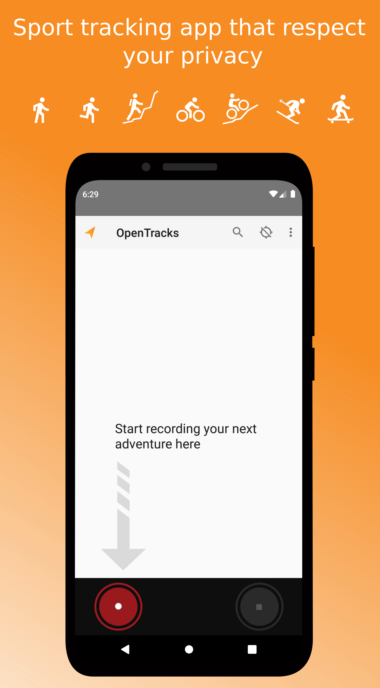
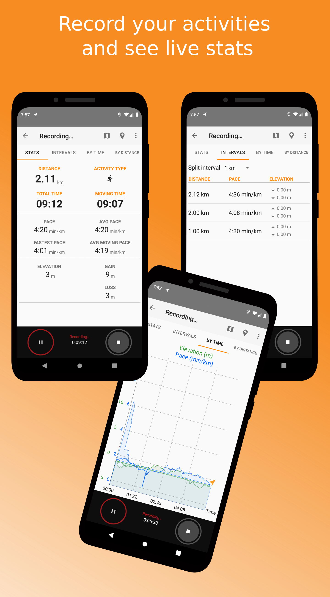
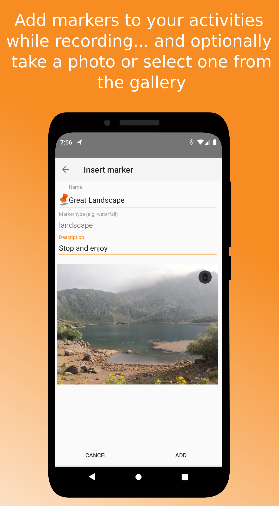
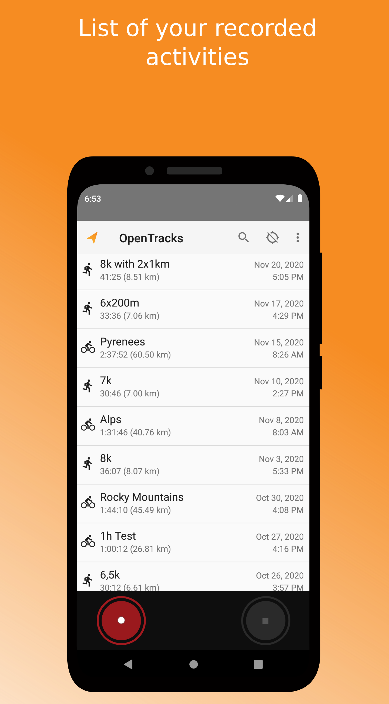
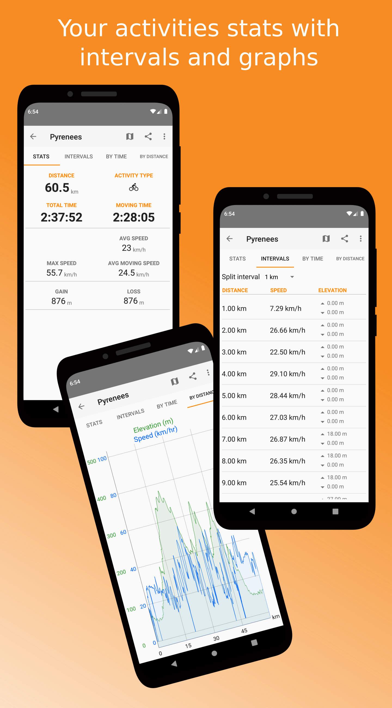
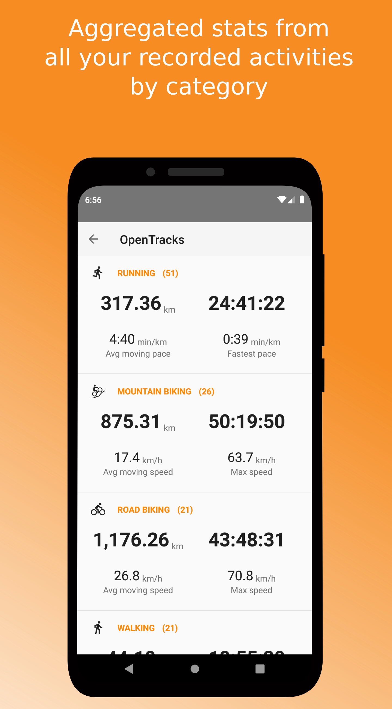
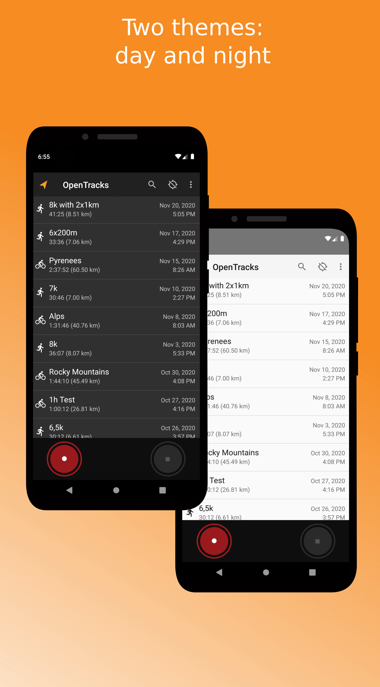
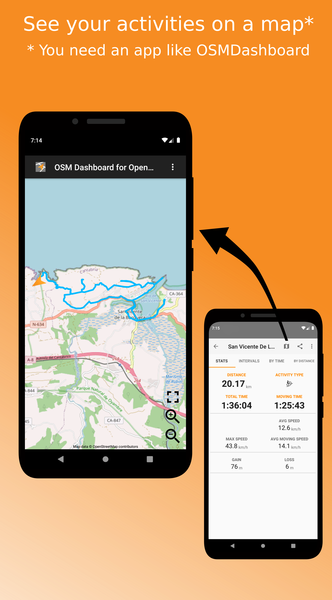

# </img> OpenTracks: a sport tracker

_OpenTracks_ is a sport tracking application that completely respects your privacy.

<table>
    <tr>
        <th>Free</th>
        <th>Donations</th>
        <th>Translations</th>
    </tr>
    <tr>
        <td align="center">
            
        </td>
        <td align="center">
            
        </td>
        <td align="center">
            
        </td>
    </tr>
    <tr>
        <td align="center">
            
        </td>
        <td align="center">
            
        </td align="center">
        <td></td>
    </tr>
    <tr>
        <td></td>
        <td align="center">
            
        </td>
        <td></td>
    </tr>
</table>

## Features:
* __Tracking:__ track your sport and outdoor activities
* __Photos and Markers:__ mark interesting locations while tracking (also with photos)
* __Bluetooth LE sensors:__
  * heart rate
  * cycling: speed and cadence
  * cycling: power meter
* __Export data:__ export tracks either as KMZ (incl. photos), KML or GPX
* __No Internet access:__ Internet is not used
* __Voice announcements__
* __No advertising__
* __Privacy:__
    * _does not contain any in-app analytics_
    * _does not use Google Play Services_
    * _has no cloud integration_

__Only required permissions:__
* _ACCESS_FINE_LOCATION_: required to use the GPS.

An overview of Bluetooth LE sensors that are known to work with OpenTracks is in [README_TESTED_SENSORS.md](README_TESTED_SENSORS.md).

_Please note:_
_OpenTracks_ does not contain a _map_ (as this would require internet access).

## Custom Dashboards (incl. Map)
As of v3.3.1 OpenTracks enables to use custom dashboards.
The reference implementation is [OSMDashboard](https://github.com/OpenTracksApp/OSMDashboard), which presents an OpenStreetMap map (showing the current track, incl. updates).
The developer documentation is in [README_API.md](README_API.md).

Alternatively, recorded tracks can be shared as KMZ/GPX to installed applications (e.g., [OsmAnd](https://play.google.com/store/apps/details?id=net.osmand)).
However, this is rather slow and does not provide updates while recording.

## Screenshots

    
    
    
    

	
    
	
	

## Project history

_OpenTracks_ is based upon Google _My Tracks app_ ([code](https://code.google.com/archive/p/mytracks/)).
Initially, _My Tracks_ was initially released by Google in 2010 as [open-source software](http://google-latlong.blogspot.fr/2010/05/code-for-my-tracks-is-now-yours.html).
In 2016, [Google decided to discontinue](https://support.google.com/maps/answer/6333516) _My Tracks_ and stopped distributing it via the Google Play store in April 2016.
The [Plonk42](https://github.com/plonk42) conducted some maintenance work until 2016, so _My Tracks_ could still be used (based upon version _Google's MyTracks_ version 2.0.6).
Plonk42's version is available [here](https://github.com/Plonk42/mytracks).
In 2019, _OpenTracks_ was forked from Plonk42's _My Tracks_ and major rework was conducted.

Rework of _OpenTracks_ included:
* removing Google's analytics code,
* removing integration into Google Drive,
* removing Google Maps integration,
* removing Google Earth integration,
* removing use of Google Play service,
* removing calorie estimation and activity estimation,
* removing support for ANT+ and Classic Bluetooth,
* adding support for Bluetooth LE heart rate sensors,
* removing Protobuf (store sensosensorr data in SQLite columns directly), and
* removing Android Service API for other apps.

Artwork, logos and user interface remained more or less unchanged.

More information about _Google My Tracks_:
* [Wikipedia page](https://en.wikipedia.org/wiki/MyTracks)
* [Google code archive](https://code.google.com/archive/p/mytracks/)
