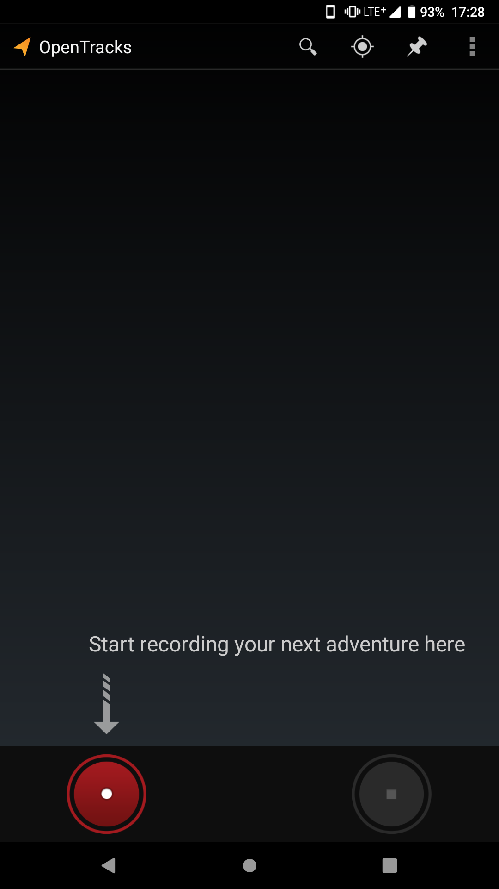
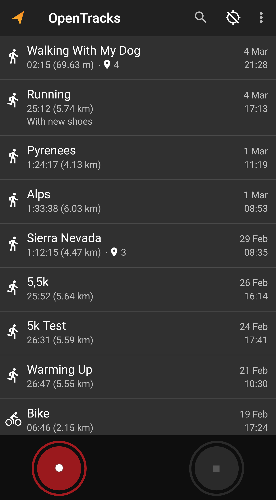
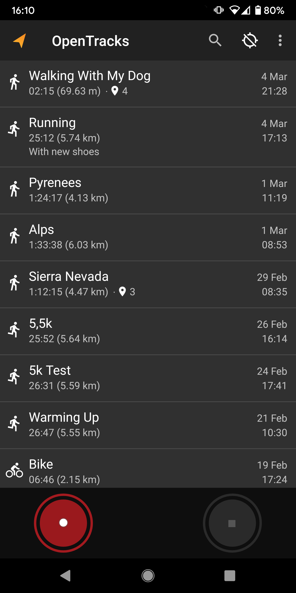
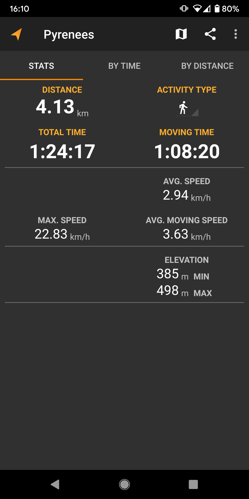

# </img> OpenTracks: a sport tracker

_OpenTracks_ is a sport tracking application that completely respects your privacy.

<table>
    <tr>
        <th>Free</th>
        <th>Paid</th>
        <th>Donations</th>
    </tr>
    <tr>
        <td>
            
        </td>
        <td>
            
        </td>
        <td>
            
        </td>
    </tr>
</table>

## Features:
* __Tracking:__ track your sport and outdoor activities 
* __Photos and Markers:__ mark interesting locations while tracking (also with photos)
* __Heart rate:__ supports Bluetooth LE sensors
* __Cycling (speed and cadence)__: supports Bluetooth LE sensors
* __Export data:__ export tracks either as KMZ (incl. photos), KML or GPX
* __No Internet access:__ Internet is not used
* __Voice announcements__
* __No advertising__
* __Privacy:__
    * _does not contain any in-app analytics_
    * _does not have Google Play Services_ 
    * _has no cloud integration_
    
__Only required permissions:__
* _ACCESS_FINE_LOCATION_: required to use the GPS.

_Please note:_
_Tracks_ does not contain a _map_ (as this would required Internet access).
To show your tracks on a map, a 3rd party application (e.g., [OsmAnd](https://play.google.com/store/apps/details?id=net.osmand) or [MAPS.ME](https://play.google.com/store/apps/details?id=com.mapswithme.maps.pro)) needs to be installed.  

## Custom Dashboards
As of v3.3.1 OpenTracks enables to use custom dashboards.
The reference implementation is [OSMDashboard](https://github.com/OpenTracksApp/OSMDashboard), which presents an OpenStreetMap map (showing the current track, incl. updates).

## Screenshots

    
    
    
    

## Project history

_OpenTracks_ is based upon Google _My Tracks app_ ([code](https://code.google.com/archive/p/mytracks/)).
Initially, _My Tracks_ was initially released by Google in 2010 as [open-source software](http://google-latlong.blogspot.fr/2010/05/code-for-my-tracks-is-now-yours.html).
In 2016, [Google decided to discontinue](https://support.google.com/maps/answer/6333516) _My Tracks_ and stopped distributing it via the Google Play store in April 2016.
The [Plonk42](https://github.com/plonk42) conducted some maintenance work until 2016, so _My Tracks_ could still be used (based upon version _Google's MyTracks_ version 2.0.6).
Plonk42's version is available [here](https://github.com/Plonk42/mytracks).
In 2019, _OpenTracks_ was forked from Plonk42's _My Tracks_ and major rework was conducted.

Rework of _OpenTracks_ included:
* removing Google's analytics code, 
* removing integration into Google Drive, 
* removing Google Maps integration,
* removing Google Earth integration,
* removing use of Google Play service,
* removing calorie estimation and activity estimation,
* removing support for ANT+ and Classic Bluetooth,
* adding support for Bluetooth LE heart rate sensors,
* removing Protobuf (store sensor data in SQLite columns directly), and
* removing Android Service API for other apps.

Artwork, logos and user interface remained more or less unchanged. 

More information about _Google My Tracks_:
* [Wikipedia page](https://en.wikipedia.org/wiki/MyTracks)
* [Google code archive](https://code.google.com/archive/p/mytracks/)
