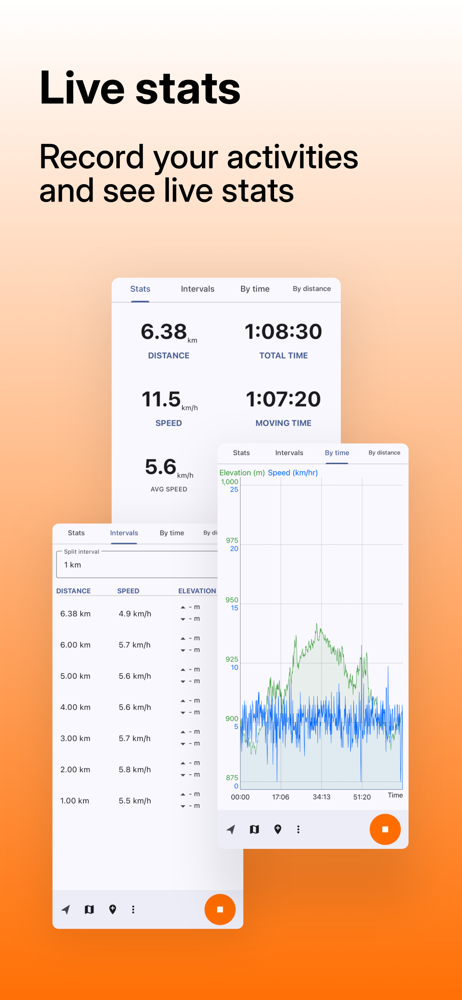
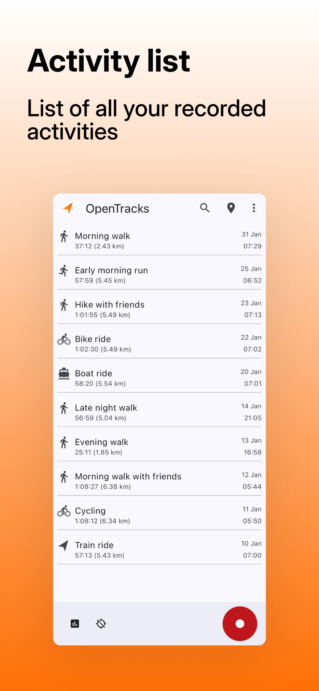
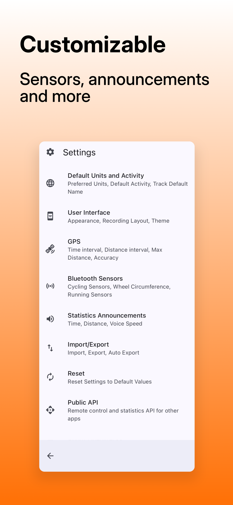

# </img> OpenTracks: a sport tracker

_OpenTracks_ is a sport tracking application that completely respects your privacy.

[](https://delightful.club/delightful-humane-design/#health)

<table>
    <tr>
        <th>Free (F-Droid)</th>
        <th>Free (Nightly for F-Droid)</th>
        <th>Donations</th>
    </tr>
    <tr>
        <td align="center">
            <a href="https://f-droid.org/packages/de.dennisguse.opentracks.playstore">
                
            </a>
        </td>
        <td align="center">
            <a href="https://fdroid.storchp.de/fdroid/repo?fingerprint=99985A7E73DCB0B16C9BDDCE7A0B4996F88068AE7C771ED53E217E69CD1FF196">
                
            </a>
        </td>
        <td align="center">
            <a href="https://liberapay.com/OpenTracks/donate">
                
            </a>
        </td>
    </tr>
    <tr>
        <td align="center">
            
        </td>
        <td></td>
        <td align="center">
            <a href="https://play.google.com/store/apps/details?id=de.dennisguse.opentracks.playstore">
                
            </a>
        </td>
    </tr>
</table>

Translations are hosted on <a href="https://hosted.weblate.org/engage/opentracks/">
hosted.weblate.org</a>.
<a href="https://hosted.weblate.org/engage/opentracks/">

</a>

## Screenshots

<div>
    
    
    
    
</div>
<div>
	
    
	
	
</div>

## Features
* __Tracking:__ track your sport and outdoor activities
* __Voice announcements__
* __Photos and Markers:__ mark interesting locations while tracking
* __Export:__
    * export tracks either as [KMZ 2.3](https://docs.opengeospatial.org/is/12-007r2/12-007r2.html) (incl. photos), [KML 2.3](https://docs.opengeospatial.org/is/12-007r2/12-007r2.html), or [GPX 1.1](https://www.topografix.com/GPX/1/1/)
    * export automatically after each recording (e.g., to sync via [Nextcloud](https://nextcloud.com/))
    * avoid duplication: each exported file contain a random unique identifier (i.e., `opentracks:trackid`)
* __Altitude:__
    * gain/loss via barometric sensor (internal if present or via Bluetooth's Environmental Sensing Service)
    * shown in EGM2008 (above mean sea level); exported as WGS84
* __Bluetooth LE sensors:__
    * heart rate
    * cycling: speed and distance
    * cycling: cadence
    * cycling: power meter
    * running: speed and cadence
    * support for BLE sensor training only (i.e., without GPS) for indoor training

  An overview of tested sensors: [README_TESTED_SENSORS.md](README_TESTED_SENSORS.md)

### Gadgetbridge integration

OpenTracks can be used with [Gadgetbridge](https://www.gadgetbridge.org/):
* shows statistics via notification on smart watches (requires Gadgetbridge 0.56.1 or later), and
* Gadgetbridge's GPX exporter generates `opentracks:trackid` to avoid duplication (Gadgetbridge 0.53.0 or later).

### Privacy
* __No Internet access:__ Internet is not used
* __No advertising__
* __No in-app analytics__
* __No use of Google Play Services__

__Only required permissions:__
* _ACCESS_FINE_LOCATION_: required to use the GPS.
* _ACCESS_BACKGROUND_LOCATION_: required to start recording with GPS while phone is in standby. (e.g. when triggered by Public API from an external device)

### Public API

OpenTracks includes an API for starting/stopping recording by another installed application (e.g., [Automate](https://llamalab.com/automate/), [Tasker](https://tasker.joaoapps.com), or [Easer](https://github.com/renyuneyun/Easer)). 
The API is disabled by default to protect the user's privacy, but it can easily be enabled in the settings. Once enabled, the API can be invoked by sending an explicit Intent to start an activity.

`Package`  (depends on the variant installed):
* F-Droid: `de.dennisguse.opentracks`
* GooglePlay: `de.dennisguse.opentracks.playStore`
* Debug: `de.dennisguse.opentracks.debug`
* Nightly: `de.dennisguse.opentracks.nightly`

`Classes`:
* **Start a recording:**  `de.dennisguse.opentracks.publicapi.StartRecording`
    * Set track data: `TRACK_NAME`, `TRACK_DESCRIPTION`, `TRACK_CATEGORY`, and `TRACK_ICON` (
      non-localized identifier
      see [/src/main/java/de/dennisguse/opentracks/util/TrackIconUtils.java#L38](/src/main/java/de/dennisguse/opentracks/util/TrackIconUtils.java#L38)).
      NOTE: if `TRACK_ICON` is not present, `TRACK_CATEGORY` will be used to determine the icon (
      localized).
    * Send recorded data to another application via _Dashboard API_: `STATS_TARGET_PACKAGE` and
      `STATS_TARGET_CLASS`
* **Stop a recording:**  `de.dennisguse.opentracks.publicapi.StopRecording`
* **Create a marker:**  `de.dennisguse.opentracks.publicapi.CreateMarker`

For testing the API using adb, the general command syntax is:

```shell
adb shell am start -e someParameter someValue -n "package/class"
```

Depending on the package and class, a complete command could look something like this:

```shell
adb shell am start -n "de.dennisguse.opentracks.playstore/de.dennisguse.opentracks.publicapi.StartRecording"
```

## File formats compatibility with open-source software
|                                                           | [GPX 1.1](https://www.topografix.com/GPX/1/1/)                                 | [KML 2.3](https://docs.opengeospatial.org/is/12-007r2/12-007r2.html) | [KMZ 2.3](https://docs.opengeospatial.org/is/12-007r2/12-007r2.html) |
|-----------------------------------------------------------|--------------------------------------------------------------------------------|----------------------------------------------------------------------|----------------------------------------------------------------------|
| [OpenLayers 7.1.0](https://openlayers.org/)               | ?                                                                              | [no](https://github.com/openlayers/openlayers/issues/14104)          | [no](https://github.com/openlayers/openlayers/issues/14104)          |
| [Golden Cheetah 3.5](https://www.goldencheetah.org/)      | ?                                                                              | [no](https://github.com/GoldenCheetah/GoldenCheetah/issues/4271)     | [no](https://github.com/GoldenCheetah/GoldenCheetah/issues/4271)     |
| [GpxPod](https://apps.nextcloud.com/apps/gpxpod)          | ?                                                                              | ?                                                                    | ?                                                                    |
| [OsmAnd](https://github.com/osmandapp/OsmAnd)             | ?                                                                              | [no](https://github.com/osmandapp/OsmAnd/issues/15271)               | [no](https://github.com/osmandapp/OsmAnd/issues/15271)               |
| [FitTrackee](https://github.com/SamR1/FitTrackee)         | yes                                                                            | n/a                                                                  | n/a                                                                  |
| [SportsTracker](https://github.com/ssaring/sportstracker) | yes, [single tracks only](https://github.com/ssaring/sportstracker/issues/260) | no                                                                   | no                                                                   |
| [ExifTool](https://exiftool.org)                          | [yes](https://exiftool.org/forum/index.php?topic=15972.0)                      | no                                                                   | no                                                                   |
| [Wanderer](https://wanderer.to/)                          | yes                      | yes                                                                   | yes                                                                   |


## Dashboard API (incl. map)

As of v3.3.1, OpenTracks supports custom dashboards for displaying previously recorded and live
tracks.

The reference implementation is [OSMDashboard](https://codeberg.org/OpenTracksApp/OSMDashboard), which
presents an OpenStreetMap map (showing the current track, incl. updates). The Dashboard API is also
used by [Gadgetbridge](https://codeberg.org/Freeyourgadget/Gadgetbridge/) for displaying live track
statistics on supported wearables.

Alternatively, recorded tracks can be shared as KMZ/GPX with installed applications (
e.g., [OsmAnd](https://play.google.com/store/apps/details?id=net.osmand)). However, this is rather
slow and does not provide updates while recording.

The developer documentation is in [README_API.md](README_API.md).

## Backup

OpenTracks stores the data in the app-internal space:
`/data/data/de.dennisguse.opentracks[|.playstore]`

There is a SQLite database `database.db` that contains the tracks as well as the markers.
Pictures attached to markers are stored as separate files.

For backup and recovery, the best approach is to export as one KMZ file.
This will contain all the tracks, pictures and the data as similar as possible as stored internally.
In difference to backing up the database directly, a KMZ allows to be imported into a different (
e.g., newer) version of OpenTracks.

## Project history

_OpenTracks_ is based upon Google _My Tracks app_ ([code](https://code.google.com/archive/p/mytracks/)).
_My Tracks_ was initially released by Google in 2010 as [open-source software](http://google-latlong.blogspot.fr/2010/05/code-for-my-tracks-is-now-yours.html).
In 2016, [Google decided to discontinue](https://support.google.com/maps/answer/6333516) _My Tracks_ and stopped distributing it via the Google Play store in April 2016.
Then [Plonk42](https://github.com/plonk42) conducted some maintenance work until 2016, so _My Tracks_ could still be used (based upon version _Google's MyTracks_ version 2.0.6).
Plonk42's version is available [here](https://github.com/Plonk42/mytracks).
In 2019, _OpenTracks_ was forked from Plonk42's _My Tracks_ and major rework was conducted.

Rework of _OpenTracks_ included:
* removing Google's analytics code,
* removing integration into Google Drive,
* removing Google Maps integration,
* removing Google Earth integration,
* removing use of Google Play service,
* removing calorie estimation and activity estimation,
* removing support for ANT+ and Classic Bluetooth,
* adding support for Bluetooth LE heart rate sensors,
* removing Protobuf (store sensor data in SQLite columns directly), and
* removing Android Service API for other apps.

Artwork, logos and user interface remained more or less unchanged.

More information about _Google My Tracks_:
* [Wikipedia page](https://en.wikipedia.org/wiki/MyTracks)
* [Google code archive](https://code.google.com/archive/p/mytracks/)
